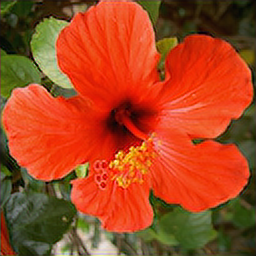
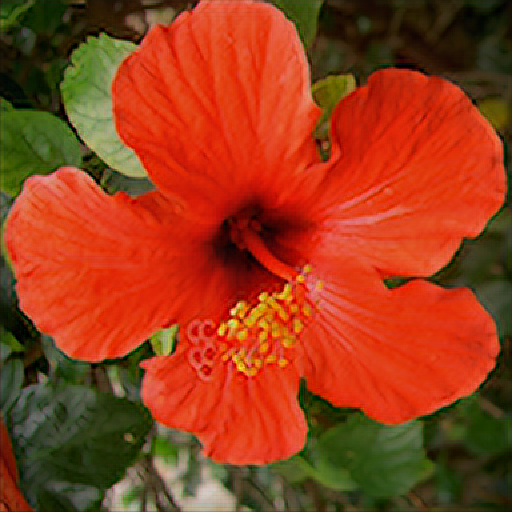

# DIV2K Model

The DIV2K model is trained on the [DIV2K dataset](https://data.vision.ee.ethz.ch/cvl/DIV2K/).

Each model is trained using an RDN from [image-super-resolution](https://github.com/idealo/image-super-resolution). The hyperparameters for each are {C: 3, D: 10, G: 64, G0: 64 }.

Each model is quantized to 8-bit.

There are three scales:

## 2x

## 3x

## 4x

